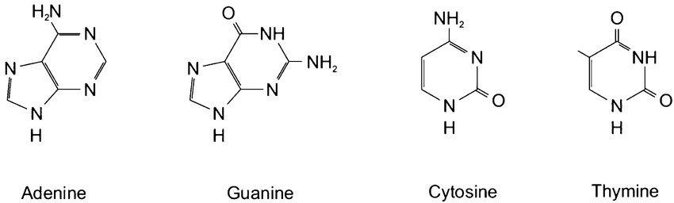
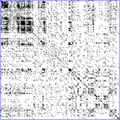
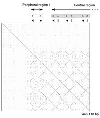
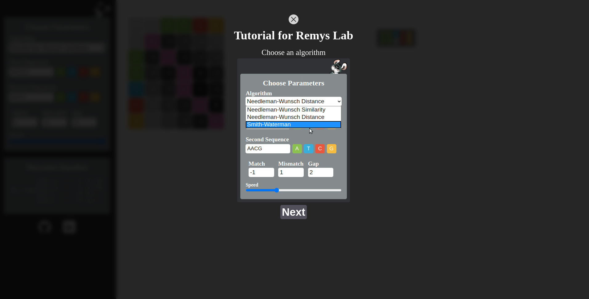
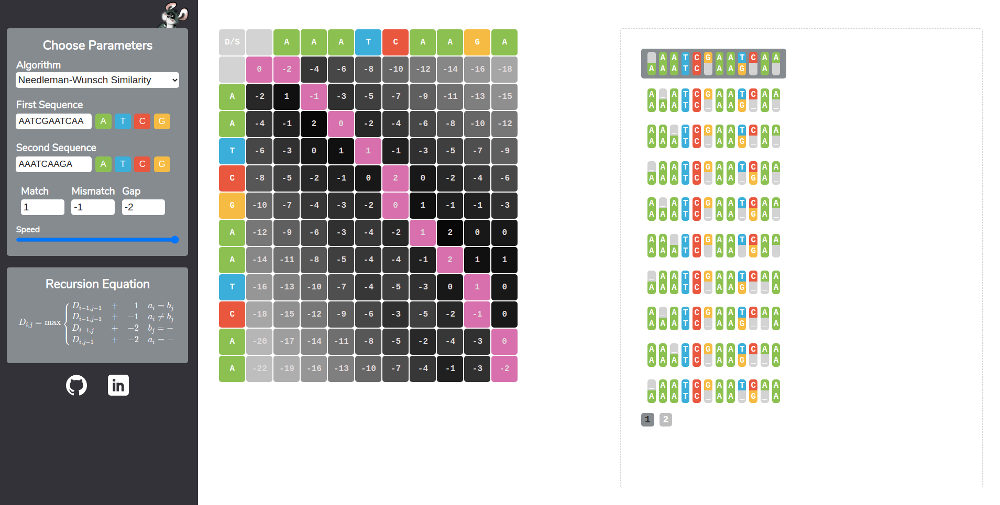

[](https://travis-ci.com/larapollehn/remy)

# DNA alignment visualization

Visualization of algorithms for nucleotide alignment.

The DNA is the fundamental building block of a living cell and is made up of a nucleotide chain.

There are four kinds of nucleotide, each differentiated from each other by its Nucleobase `guanine`, `adenine`, `cytosine` and `thymine`.



In bioinformatics, a sequence alignment is a way of arranging the sequences of DNA, RNA, or protein to identify regions of 
similarity that may be a consequence of functional, structural, or evolutionary relationships between the sequences.
Aligned sequences of nucleotide or amino acid residues are typically represented as rows within a matrix. Gaps are inserted 
between the residues so that identical or similar characters are aligned in successive columns. Sequence alignments are also used 
for non-biological sequences, such as calculating the distance cost between strings in a natural language or in financial data.

<table border="1" width="100%">
    <tr>
        <td></td>
        <td></td>
    </tr>
</table>

## Needleman-Wunsch

Saul B. Needleman and Christian D. Wunsch introduced 1970 an approach to compute the optimal global alignment of two sequences for comparing 
two nucleotide or amino acid sequences.

## Smith Waterman

The Smith–Waterman algorithm performs local sequence alignment; that is, for determining similar regions between two strings of nucleic acid 
sequences or protein sequences. Instead of looking at the entire sequence, the Smith–Waterman algorithm compares segments of all possible lengths and 
optimizes the similarity measure.

## Usage of the algorithms

Needleman-Wunsch similarity

```typescript
import NeedlemanWunschSimilarity from "./src/algorithms/NeedlemanWunschSimilarity";
import SimpleTextProducer from "./src/text/SimpleTextProducer";

const similarity  = new NeedlemanWunschSimilarity("ATCCTC", "AACG", 1, -1, -2);
const similarityTextProducer = new SimpleTextProducer(similarity);
const similarityTexts = similarityTextProducer.produceText();
console.log(similarityTexts);
```

Needleman-Wunsch distance

```typescript

import NeedlemanWunschDistance from "./src/algorithms/NeedlemanWunschDistance";
import SimpleTextProducer from "./src/text/SimpleTextProducer";

const distance  = new NeedlemanWunschDistance("ATCCTC", "AACG", 1, -1, -2);
const distanceTextProducer = new SimpleTextProducer(distance);
const distanceTexts = distanceTextProducer.produceText();
console.log(distanceTexts);
```

Smith-Waterman 

```typescript
import SmithWaterman from "./src/algorithms/SmithWaterman";
import SimpleTextProducer from "./src/text/SimpleTextProducer";


const smithWaterman = new SmithWaterman("ATCGAAT", "AACGTA",1, -1, -2);
const smithWatermanTextProducer = new SimpleTextProducer(smithWaterman);
const smithWatermanTexts = smithWatermanTextProducer.produceText();
console.log(smithWatermanTexts);
```

## Remys Lab - Webapp 

Remys Lab is an application that provides multiple algorithms, takes a specific set of parameters and visualizes all 
possible paths leading to the best alignment-score. 

##### Available algorithms
* Smith-Waterman
* Needleman-Wunsch Distance
* Needleman-Wunsch Similarity

<table border="1" width="100%">
    <tr>
        <td></td>
    </tr>
     <tr>
            <td></td>
        </tr>
</table>
